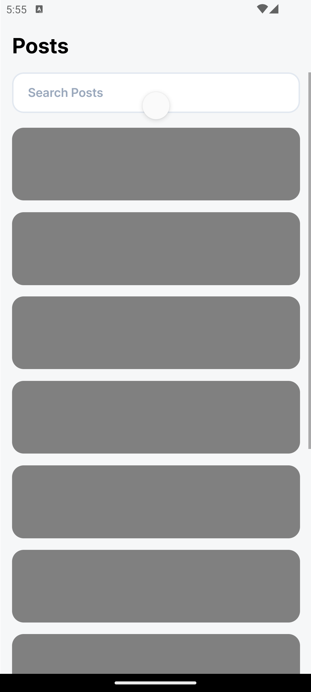
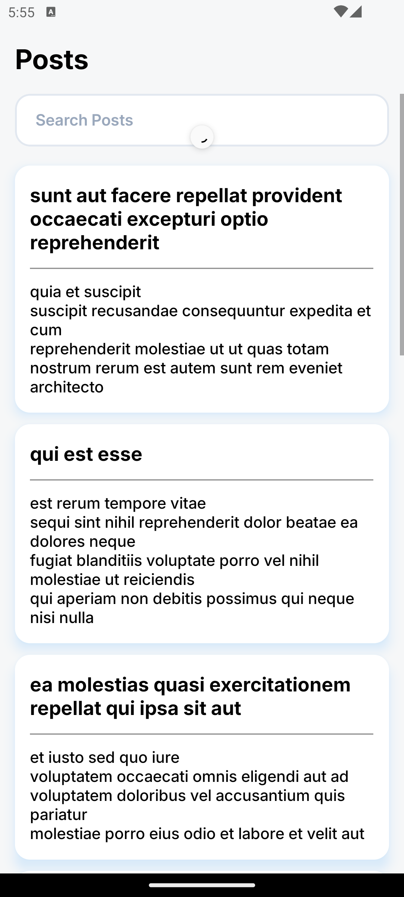
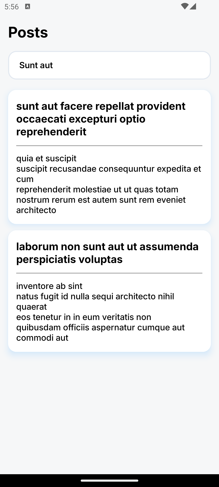

# React Native Task Assesment app

A React Native mobile application to fetch Posts and list, with Search (persisted) and loading animations.

---

## 📸 Screenshots

  
  
  
  

---

## Tech Stack

- React Native
- TypeScript
- Redux Toolkit
- React Navigation
- Moment.js
- React Native Snackbar
- axios

---

## Note:

- React Native Version: 0.81.5 (stable)
- Additional Libraries Intalled: @react-native-async-storage/async-storage @react-native-community/netinfo @react-navigation/native @react-navigation/native-stack @reduxjs/toolkit axios moment react-native-gesture-handler react-native-keyboard-controller react-native-reanimated react-native-snackbar react-native-svg react-native-worklets react-redux redux-persist
- Bonus Features: Loading indicator while fetching, Skeleton loader UI, Pull-to-refresh, Reusable <PostCard /> component & Clean folder structure.

---

## Prerequisites

Make sure you have the following installed React-Native Locally:

https://reactnative.dev/docs/environment-setup

---

## Run App

# Clone the Project

git clone https://github.com/kanthvagale/ReactNativeTask.git

# change directory

cd ReactNativeTask

# Install Dependancies

npm install

# Run Android

npx react-native run-android

# Run IOS

sudo gem install cocoapods

cd ios

pod install

cd ..

npx react-native run-ios

